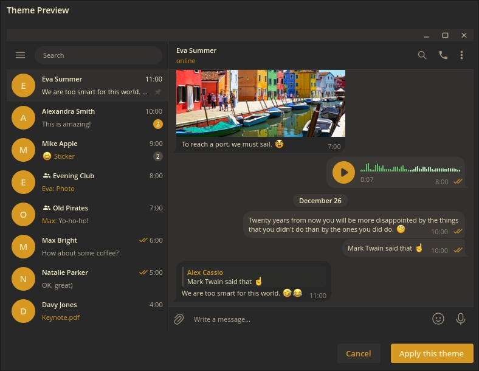
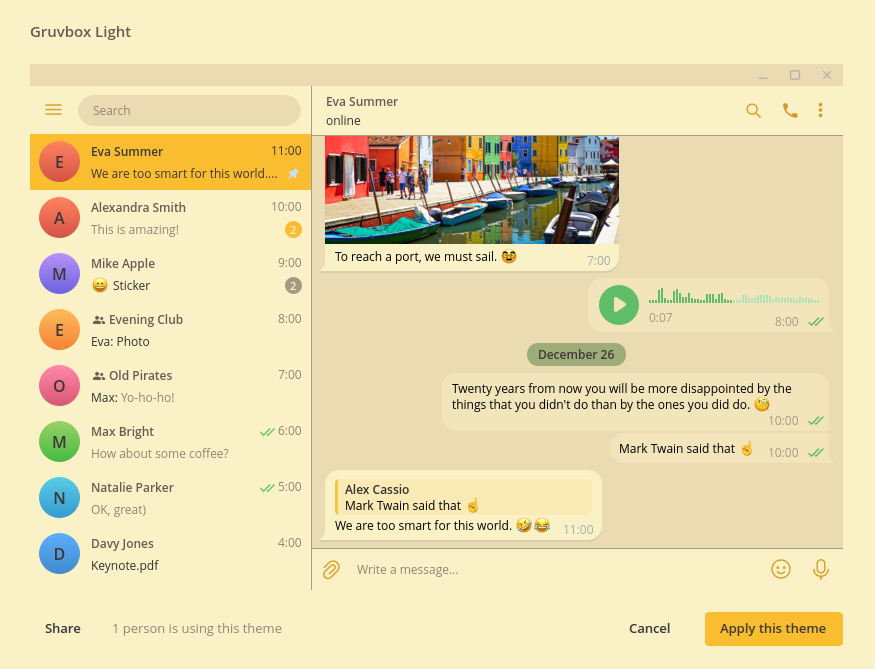

# Yet another one [Gruvbox](https://github.com/morhetz/gruvbox) port for [Telegram](https://desktop.telegram.org)

## Important note

I switched to KDE, this repo no longer maintained. Archived, but not permanent.

---

## Why you should use this instead of other Gruvbox themes

- It's newer
- It's relevant
- It will be constantly updated (at least while I'm using Gruvbox theme)
